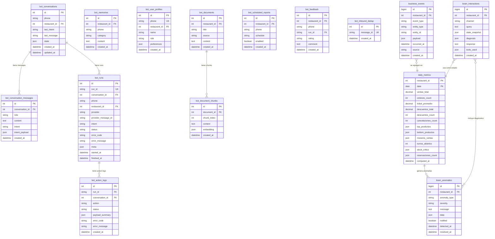
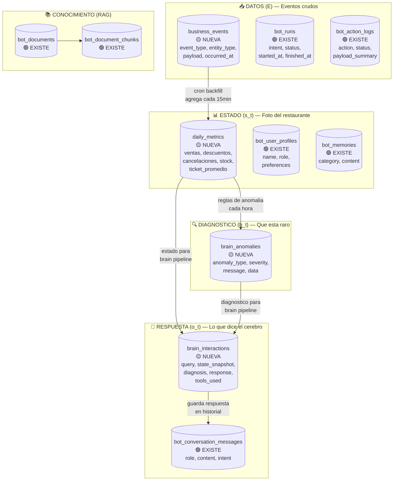

# GrowthSuite Cerebro — Diagrama de Base de Datos

> Como leer este diagrama: Las tablas VERDES ya existen. Las AMARILLAS son NUEVAS (hay que crearlas).
> Cada tabla dice a que caja del loop pertenece.

---

## 1. Diagrama ERD completo



---

## 2. Mapa de tablas por caja del loop



---

## 3. Flujo de datos entre servicios (como se conecta el cerebro al POS)

```mermaid
flowchart LR
    subgraph POS_EXISTENTE["POS EXISTENTE (no tocar)"]
        OA[("pos_order_api<br/>orders, products,<br/>payments")]
        CA[("pos_cash_api<br/>shifts, cash_movements,<br/>tips")]
        IA[("pos_inventory_api<br/>inventory_items,<br/>stocks, recipes")]
        RA[("pos_reservation_api<br/>reservations,<br/>guests")]
        AA[("pos_auth_api<br/>users, roles,<br/>restaurants")]
    end

    subgraph CEREBRO["CEREBRO (app/brain/) — NUEVO"]
        BACKFILL["⏰ Cron backfill<br/>cada 15min<br/>READ ONLY"]
        BE2[("business_events")]
        DM2[("daily_metrics")]
        RULES["🔍 Reglas anomalia"]
        BA2[("brain_anomalies")]
        STATE["buildRestaurantState()"]
        DIAG["diagnose()"]
        LLM["🤖 LLM + Tools"]
        BI2[("brain_interactions")]
    end

    subgraph CANALES["CANALES DE SALIDA"]
        WA["📱 WhatsApp"]
        ADMIN["💻 POS Admin"]
    end

    OA -->|"lee orders,<br/>products"| BACKFILL
    CA -->|"lee shifts,<br/>cash_movements"| BACKFILL
    IA -->|"lee stocks,<br/>recipes"| BACKFILL
    RA -->|"lee reservations"| BACKFILL

    BACKFILL --> BE2
    BE2 -->|"agrega"| DM2
    DM2 --> STATE
    DM2 --> RULES
    RULES --> BA2
    STATE --> LLM
    BA2 --> DIAG
    DIAG --> LLM
    LLM --> BI2
    LLM --> WA
    LLM --> ADMIN

    style CEREBRO fill:#1a3a2a,stroke:#00ff88
    style POS_EXISTENTE fill:#1a2a3a,stroke:#4488ff
    style CANALES fill:#3a2a1a,stroke:#ffaa44
```



---

## 4. Las 4 tablas NUEVAS que hay que crear

### 4.1 `business_events` — Caja: DATOS

```sql
-- El event log del negocio. TODO lo que pasa se guarda aqui.
CREATE TABLE business_events (
    id            bigserial PRIMARY KEY,
    restaurant_id integer NOT NULL,
    event_type    text NOT NULL,       -- 'order_created', 'discount_applied', etc.
    entity_type   text NOT NULL,       -- 'order', 'shift', 'product', 'stock'
    entity_id     text NOT NULL,       -- ID de la entidad en el POS
    payload       jsonb NOT NULL,      -- datos completos del evento
    occurred_at   timestamptz NOT NULL,-- cuando paso en el negocio
    source        text NOT NULL,       -- 'pos_order_api', 'pos_cash_api', etc.
    created_at    timestamptz DEFAULT now()
);

CREATE INDEX idx_be_restaurant_time ON business_events (restaurant_id, occurred_at DESC);
CREATE INDEX idx_be_restaurant_type ON business_events (restaurant_id, event_type, occurred_at DESC);
```

**Quien la llena:** Cron `brain:backfill-events` (Jampier) lee tablas del POS cada 15min.
**Quien la consume:** `daily_metrics` cron nocturno.

**Tipos de evento iniciales:**

| event_type | entity_type | source | Ejemplo payload |
|---|---|---|---|
| `order_created` | order | pos_order_api | `{total, items, waiter_id, table}` |
| `order_paid` | order | pos_order_api | `{total, payment_method}` |
| `discount_applied` | order_item | pos_order_api | `{amount, reason, waiter_id}` |
| `order_cancelled` | order_item | pos_order_api | `{product, reason, waiter_id}` |
| `shift_opened` | shift | pos_cash_api | `{station, user_id}` |
| `shift_closed` | shift | pos_cash_api | `{total, expected, difference}` |
| `stock_updated` | inventory | pos_inventory_api | `{item, qty_before, qty_after}` |
| `reservation_created` | reservation | pos_reservation_api | `{guests, datetime, status}` |

### 4.2 `daily_metrics` — Caja: ESTADO

```sql
-- Foto resumida del restaurante por dia.
CREATE TABLE daily_metrics (
    restaurant_id  integer NOT NULL,
    date           date NOT NULL,
    ventas_total   numeric(12,2),
    ordenes_count  integer,
    ticket_promedio numeric(10,2),
    descuentos_total numeric(10,2),
    descuentos_count integer,
    cancelaciones_count integer,
    top_productos  jsonb,          -- [{id, name, qty, total}]
    bottom_productos jsonb,
    meseros_ventas jsonb,          -- [{waiter_id, name, total}]
    turnos_abiertos integer,
    stock_critico  jsonb,          -- [{item_id, name, qty, min}]
    reservaciones_count integer,
    computed_at    timestamptz DEFAULT now(),
    PRIMARY KEY (restaurant_id, date)
);
```

**Quien la llena:** Cron `brain:compute-metrics` (Jampier) a las 2am + cada hora durante el dia.
**Quien la consume:** `buildRestaurantState()`, `diagnose()`, briefings.

### 4.3 `brain_anomalies` — Caja: DIAGNOSTICO

```sql
-- Anomalias detectadas por las reglas.
CREATE TABLE brain_anomalies (
    id              bigserial PRIMARY KEY,
    restaurant_id   integer NOT NULL,
    anomaly_type    text NOT NULL,       -- 'discount_anomaly', 'sales_drop', etc.
    severity        text NOT NULL,       -- 'low', 'medium', 'high'
    message         text NOT NULL,       -- "Descuentos 78% arriba de lo normal"
    data            jsonb NOT NULL,      -- {today, avg14d, std14d, top_waiter}
    notified        boolean DEFAULT false,
    detected_at     timestamptz NOT NULL,
    resolved_at     timestamptz,         -- null = aun activa
    created_at      timestamptz DEFAULT now()
);

CREATE INDEX idx_ba_restaurant ON brain_anomalies (restaurant_id, detected_at DESC);
```

**Quien la llena:** Cron `brain:check-anomalies` (reglas de Jampier) cada hora.
**Quien la consume:** `diagnose()` en el brain pipeline, alertas de Hector.

### 4.4 `brain_interactions` — Caja: RESPUESTA + IMPACTO

```sql
-- Cada interaccion del cerebro. Semilla del dataset futuro.
CREATE TABLE brain_interactions (
    id              bigserial PRIMARY KEY,
    restaurant_id   integer NOT NULL,
    channel         text NOT NULL,       -- 'whatsapp', 'admin', 'cron'
    query           text,                -- lo que pregunto el usuario (null si cron)
    state_snapshot  jsonb NOT NULL,      -- foto del estado al momento
    diagnosis       jsonb,               -- anomalias activas al momento
    response        text NOT NULL,       -- lo que respondio el cerebro
    tools_used      jsonb,               -- [{tool, input, output}]
    created_at      timestamptz DEFAULT now()
);

CREATE INDEX idx_bi_restaurant ON brain_interactions (restaurant_id, created_at DESC);
```

**Quien la llena:** `logBrainInteraction()` (Hector) al final de cada `brainResponse()`.
**Quien la consume:** Futuro — training data para modelos aprendidos.

---

## 5. Como se relacionan las tablas NUEVAS con las EXISTENTES

```mermaid
flowchart TB
    subgraph EXISTE["🟢 YA EXISTE en pos_bot_api"]
        BC["bot_conversations"]
        BCM["bot_conversation_messages"]
        BR["bot_runs"]
        BAL["bot_action_logs"]
        BM["bot_memories"]
        BUP["bot_user_profiles"]
        BSR["bot_scheduled_reports"]
        BD["bot_documents"]
        BDC["bot_document_chunks"]
        BF["bot_feedback"]
    end

    subgraph NUEVO["🟡 NUEVO — Cerebro"]
        BE["business_events"]
        DM["daily_metrics"]
        BANOM["brain_anomalies"]
        BI["brain_interactions"]
    end

    subgraph POS_DB["📦 DBs del POS (solo lectura)"]
        ORDERS["orders + order_items"]
        SHIFTS["shifts + cash_movements"]
        STOCKS["inventory_stocks"]
        RESERV["reservations"]
    end

    POS_DB -->|"backfill<br/>READ ONLY"| BE
    BE -->|"agrega"| DM
    DM -->|"reglas"| BANOM
    DM -->|"estado"| BI
    BANOM -->|"diagnostico"| BI

    BC -.->|"historial<br/>conversacion"| BI
    BM -.->|"memoria<br/>persistente"| BI
    BUP -.->|"perfil<br/>usuario"| BI
    BD -.->|"RAG"| BI

    style NUEVO fill:#2a4a2a,stroke:#00ff88,stroke-width:3px
    style EXISTE fill:#2a2a4a,stroke:#8888ff
    style POS_DB fill:#4a2a2a,stroke:#ff8888
```



---

## 6. Regla de separacion

| Tablas | Quien escribe | Quien lee | Desde donde |
|--------|--------------|-----------|-------------|
| POS (orders, shifts, stocks) | POS APIs | Cerebro (READ ONLY) | Cron backfill |
| business_events | Cron backfill (Jampier) | daily_metrics cron | pos_bot_api |
| daily_metrics | Cron compute (Jampier) | Brain pipeline (Hector) | pos_bot_api |
| brain_anomalies | Cron anomalias (Jampier) | Brain pipeline (Hector) | pos_bot_api |
| brain_interactions | Brain pipeline (Hector) | Futuro ML | pos_bot_api |
| bot_* (existentes) | Bot pipeline actual | Bot pipeline actual | No tocar |
