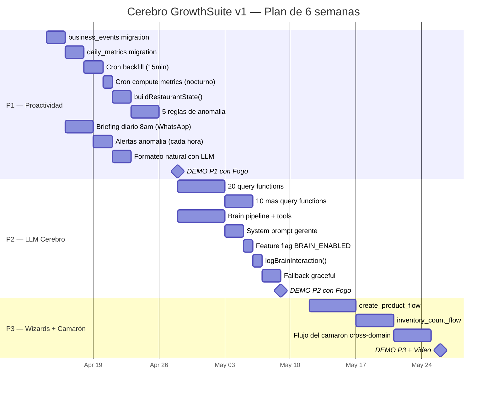

# GrowthSuite — Roadmap Visual

> Abre este archivo en Obsidian para ver los diagramas renderizados.
> Cada tarea dice: quien, que caja del loop, que pilar, y de que depende.

---

## 1. Timeline General (6 semanas)

---

## 2. Board estilo Linear — P1: Proactividad

```mermaid
flowchart LR
    subgraph BACKLOG["📋 Backlog"]
        T1["🟡 J: business_events migration<br/>Caja: Datos<br/>Pilar: Todos<br/>Dep: ninguna"]
        T2["🟡 J: daily_metrics migration<br/>Caja: Estado<br/>Pilar: Todos<br/>Dep: T1"]
    end

    subgraph TODO["📝 To Do"]
        T3["🟡 J: Cron backfill 15min<br/>Caja: Datos<br/>Pilar: Todos<br/>Dep: T1"]
        T4["🟡 J: Cron compute metrics<br/>Caja: Estado<br/>Pilar: Todos<br/>Dep: T2"]
        T5["🟡 J: buildRestaurantState<br/>Caja: Estado<br/>Pilar: Todos<br/>Dep: T4"]
    end

    subgraph IN_PROGRESS["🔨 In Progress"]
        T6["🟡 J: 5 reglas anomalia<br/>Caja: Diagnostico<br/>Pilar: Utilidad<br/>Dep: T5"]
        T7["🟢 H: Briefing diario 8am<br/>Caja: Respuesta<br/>Pilar: Operacion<br/>Dep: T5"]
    end

    subgraph DONE["✅ Done"]
        T8["🟢 H: Alertas anomalia<br/>Caja: Respuesta<br/>Pilar: Utilidad<br/>Dep: T6,T7"]
    end

    T1 --> T2 --> T4 --> T5 --> T6 --> T8
    T1 --> T3
    T5 --> T7 --> T8

    style BACKLOG fill:#1a1a2e
    style TODO fill:#16213e
    style IN_PROGRESS fill:#0f3460
    style DONE fill:#1a3a2a
```

---

## 3. Board estilo Linear — P2: LLM Cerebro

```mermaid
flowchart LR
    subgraph BACKLOG2["📋 Backlog"]
        Q1["🟡 J: queries/sales.ts<br/>getSalesForDate, compareSales,<br/>getTopProducts, getSalesByWaiter"]
        Q2["🟡 J: queries/discounts.ts<br/>getDiscountsForDate,<br/>getDiscountsByWaiter,<br/>getDiscountTrend"]
        Q3["🟡 J: queries/cancellations.ts<br/>getCancellationsForDate,<br/>getCancellationsByProduct"]
        Q4["🟡 J: queries/inventory.ts<br/>getCriticalStock,<br/>getStockForItem,<br/>checkIngredientForReservations"]
        Q5["🟡 J: queries/reservations.ts<br/>getReservationsToday,<br/>getReservationsTomorrow,<br/>getNoShowRate"]
        Q6["🟡 J: queries/shifts.ts<br/>getCurrentShift,<br/>getShiftSummary"]
        Q7["🟡 J: queries/waiters.ts<br/>getWaiterPerformance,<br/>getWaiterComparison"]
    end

    subgraph TODO2["📝 To Do"]
        P1["🟢 H: brain/pipeline.ts<br/>brainResponse() principal"]
        P2["🟢 H: brain/tools/*.ts<br/>wrap cada query como tool"]
        P3["🟢 H: brain/prompts/gerente.ts<br/>system prompt con estado"]
    end

    subgraph IN_PROGRESS2["🔨 In Progress"]
        P4["🟢 H: Feature flag<br/>BRAIN_ENABLED"]
        P5["🟢 H: Fallback graceful<br/>nunca 'no entiendo'"]
        P6["🟢 H: logBrainInteraction<br/>guarda (s,q,o)"]
    end

    Q1 & Q2 & Q3 & Q4 & Q5 & Q6 & Q7 --> P2
    P1 --> P4
    P2 --> P4
    P3 --> P4
    P4 --> P5
    P4 --> P6

    style BACKLOG2 fill:#1a1a2e
    style TODO2 fill:#16213e
    style IN_PROGRESS2 fill:#0f3460
```

---

## 4. Board estilo Linear — P3: Wizards + Demo

```mermaid
flowchart LR
    subgraph BACKLOG3["📋 Backlog"]
        W1["🔵 Ambos: create_product_flow<br/>Wizard: nombre → categoria →<br/>precio → area → insumo →<br/>presentacion → receta →<br/>confirmar → crear<br/>Pilar: Operacion"]
        W2["🔵 Ambos: inventory_count_flow<br/>Wizard: almacen → grupo →<br/>insumo por insumo → diferencias →<br/>resumen → aplicar ajuste<br/>Pilar: Utilidad"]
    end

    subgraph TODO3["📝 To Do"]
        W3["🔵 Ambos: flujo del camaron<br/>Cron: reservaciones mañana →<br/>cruce recetas × stock →<br/>detecta faltante →<br/>sugiere pedido proveedor →<br/>confirmacion → ejecuta<br/>Pilar: Los 3"]
    end

    subgraph DEMO["🎬 Demo"]
        D1["📹 Video: 3 consultas<br/>con dato+diagnostico+sugerencia"]
        D2["📹 Video: briefing 8am<br/>llegando al WhatsApp"]
        D3["📹 Video: flujo camaron<br/>end-to-end"]
    end

    W1 --> W3
    W2 --> W3
    W3 --> D1 & D2 & D3

    style BACKLOG3 fill:#1a1a2e
    style TODO3 fill:#16213e
    style DEMO fill:#3a2a1a
```

---

## 5. Dependencias criticas (que bloquea que)

```mermaid
flowchart TD
    M1["🟡 business_events<br/>(migracion)"] --> M2["🟡 daily_metrics<br/>(migracion)"]
    M1 --> C1["⏰ Cron backfill"]
    M2 --> C2["⏰ Cron compute"]
    C2 --> S1["buildRestaurantState()"]
    S1 --> R1["5 reglas anomalia"]
    S1 --> B1["Briefing diario"]
    R1 --> A1["Alertas anomalia"]
    S1 --> P1["Brain pipeline"]
    R1 --> P1

    Q1["20-30 queries"] --> T1["Tools para LLM"]
    T1 --> P1
    P1 --> F1["Feature flag"]
    F1 --> DEMO1["🎯 DEMO P1+P2"]

    P1 --> W1["create_product_flow"]
    P1 --> W2["inventory_count_flow"]
    W1 & W2 --> W3["Flujo camaron"]
    W3 --> DEMO2["🎯 DEMO P3 + Video"]

    style M1 fill:#4a3a1a,stroke:#ffaa44
    style M2 fill:#4a3a1a,stroke:#ffaa44
    style DEMO1 fill:#1a4a1a,stroke:#00ff88
    style DEMO2 fill:#1a4a1a,stroke:#00ff88
```

---

## 6. Detalle de cada tarea con checklist

### P1.1 — business_events migration (Jampier, Dia 1)
- [ ] Crear migracion en `database/migrations/`
- [ ] Crear modelo `app/models/business_event.ts`
- [ ] Indices: `(restaurant_id, occurred_at)` y `(restaurant_id, event_type, occurred_at)`
- [ ] Test: insertar 100 eventos, verificar indices
- **Caja:** Datos (E)
- **Bloquea:** daily_metrics, backfill cron

### P1.2 — daily_metrics migration (Jampier, Dia 1-2)
- [ ] Crear migracion en `database/migrations/`
- [ ] Crear modelo `app/models/daily_metric.ts`
- [ ] PK compuesta: `(restaurant_id, date)`
- [ ] Test: insertar metricas, verificar upsert
- **Caja:** Estado (s_t)
- **Bloquea:** buildRestaurantState, reglas, briefings

### P1.3 — Cron backfill (Jampier, Dia 2-3)
- [ ] Comando `brain:backfill-events` en `commands/`
- [ ] Lee tablas del POS (orders, shifts, cash_movements) via HTTP a cada API
- [ ] Guarda solo eventos nuevos (compara ultimo `occurred_at`)
- [ ] READ ONLY — nunca escribe al POS
- [ ] Test: correr contra Fogo, verificar eventos creados
- **Caja:** Datos (E)
- **Frecuencia:** cada 15 min

### P1.4 — Cron compute metrics (Jampier, Dia 3)
- [ ] Comando `brain:compute-metrics` en `commands/`
- [ ] Agrega business_events del dia en daily_metrics
- [ ] Upsert: si ya existe el registro, actualiza
- [ ] Test: verificar que metricas cuadren con POS
- **Caja:** Estado (s_t)
- **Frecuencia:** cada hora + 2am nocturno completo

### P1.5 — buildRestaurantState (Jampier, Dia 4)
- [ ] Archivo: `app/brain/state/build_state.ts`
- [ ] Lee daily_metrics de hoy + ayer + promedio 14d
- [ ] Lee reservaciones de hoy de pos_reservation_api
- [ ] Lee stock critico de pos_inventory_api
- [ ] Retorna tipo `RestaurantState` documentado
- [ ] Test: llamar con restaurant_id=40, verificar estructura
- **Caja:** Estado (s_t)
- **Bloquea:** reglas, briefings, brain pipeline

### P1.6 — 5 reglas de anomalia (Jampier, Dia 5-7)
- [ ] `app/brain/rules/discount_anomaly.ts` — if descuentos > avg + 1.5σ
- [ ] `app/brain/rules/cancellation_anomaly.ts` — if cancelaciones > avg + 1.5σ
- [ ] `app/brain/rules/sales_drop.ts` — if ventas < avg - 1.5σ para dia comparable
- [ ] `app/brain/rules/critical_stock.ts` — if stock < min level
- [ ] `app/brain/rules/unclosed_shift.ts` — if turno abierto > 14 horas
- [ ] `app/brain/diagnosis/diagnose.ts` — corre todas y retorna `Diagnosis[]`
- [ ] Test: cada regla con datos mock
- **Caja:** Diagnostico (b_t)
- **Bloquea:** alertas, brain pipeline

### P1.7 — Briefing diario (Hector, Dia 3-5)
- [ ] Archivo: `app/brain/briefing/daily.ts`
- [ ] Cron a las 8am: `brain:send-briefing`
- [ ] Llama `buildRestaurantState()` + `diagnose()`
- [ ] Manda resumen formateado por WhatsApp
- [ ] Formato: ventas ayer, comparativo, anomalias, foco del dia
- [ ] Test: generar briefing para Fogo, verificar formato
- **Caja:** Respuesta (o_t)
- **Pilar:** Facilitar operacion

### P1.8 — Alertas anomalia (Hector, Dia 5-7)
- [ ] Archivo: `app/brain/briefing/anomaly_alert.ts`
- [ ] Cron cada hora: si hay anomalia severity >= medium → WhatsApp
- [ ] No repetir alerta ya notificada (campo `notified` en brain_anomalies)
- [ ] Formato: emoji severity + dato + comparativo + sugerencia
- [ ] Test: simular anomalia, verificar que llega WhatsApp
- **Caja:** Respuesta (o_t)
- **Pilar:** Proteger utilidad

---

## 7. Las 30 queries que Jampier tiene que hacer (P2)

| # | Archivo | Funcion | Retorna | Dominio |
|---|---------|---------|---------|---------|
| 1 | sales.ts | `getSalesForDate(rid, date)` | `{total, count, avgTicket}` | Ventas |
| 2 | sales.ts | `compareSales(rid, dateA, dateB)` | `{a, b, delta, pctChange}` | Ventas |
| 3 | sales.ts | `getSalesByHour(rid, date)` | `[{hour, total}]` | Ventas |
| 4 | sales.ts | `getTopProducts(rid, period, limit)` | `[{id, name, qty, total}]` | Ventas |
| 5 | sales.ts | `getBottomProducts(rid, period, limit)` | `[{id, name, qty, total}]` | Ventas |
| 6 | sales.ts | `getSalesByPaymentMethod(rid, date)` | `[{method, total, count}]` | Ventas |
| 7 | discounts.ts | `getDiscountsForDate(rid, date)` | `{total, count, items}` | Descuentos |
| 8 | discounts.ts | `getDiscountsByWaiter(rid, date)` | `[{waiter, total, count}]` | Descuentos |
| 9 | discounts.ts | `getDiscountTrend(rid, days)` | `[{date, total}]` | Descuentos |
| 10 | cancellations.ts | `getCancellationsForDate(rid, date)` | `{count, items}` | Cancelaciones |
| 11 | cancellations.ts | `getCancellationsByProduct(rid, date)` | `[{product, count}]` | Cancelaciones |
| 12 | cancellations.ts | `getCancellationsByWaiter(rid, date)` | `[{waiter, count}]` | Cancelaciones |
| 13 | inventory.ts | `getCriticalStock(rid)` | `[{item, qty, min, pct}]` | Inventario |
| 14 | inventory.ts | `getStockForItem(rid, itemName)` | `{item, qty, unit, min}` | Inventario |
| 15 | inventory.ts | `checkIngredientForReservations(rid, date)` | `[{item, need, have, gap}]` | Inventario |
| 16 | inventory.ts | `getStockMovements(rid, item, days)` | `[{date, type, qty}]` | Inventario |
| 17 | reservations.ts | `getReservationsForDate(rid, date)` | `{count, guests, details}` | Reservaciones |
| 18 | reservations.ts | `getOccupancyRate(rid, date)` | `{reserved, capacity, pct}` | Reservaciones |
| 19 | reservations.ts | `getNoShowRate(rid, days)` | `{rate, count}` | Reservaciones |
| 20 | shifts.ts | `getCurrentShift(rid)` | `{id, station, openedAt, user}` | Caja |
| 21 | shifts.ts | `getShiftSummary(rid, shiftId)` | `{total, cash, card, tips}` | Caja |
| 22 | shifts.ts | `getCashDifference(rid, date)` | `{expected, actual, diff}` | Caja |
| 23 | waiters.ts | `getWaiterPerformance(rid, date)` | `[{waiter, sales, tickets}]` | Staff |
| 24 | waiters.ts | `getWaiterComparison(rid, period)` | `[{waiter, avg, rank}]` | Staff |
| 25 | products.ts | `getProductMargin(rid, productId)` | `{cost, price, margin}` | Productos |
| 26 | products.ts | `getProductsByCategory(rid)` | `[{category, products}]` | Productos |
| 27 | products.ts | `searchProductByName(rid, name)` | `[{id, name, price}]` | Productos |
| 28 | metrics.ts | `getDailyMetrics(rid, date)` | `DailyMetrics` | General |
| 29 | metrics.ts | `getAvgMetrics(rid, days)` | `DailyMetrics` | General |
| 30 | metrics.ts | `getMetricsTrend(rid, days)` | `[DailyMetrics]` | General |

---

_Ultima actualizacion: 2026-04-09_
_Mover tareas de Backlog → To Do → In Progress → Done conforme avanzan_
